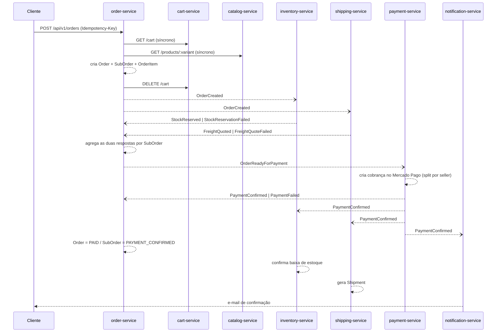

# Ecommerce Event-Driven

> Marketplace multi-seller (estilo Mercado Livre) construído como um conjunto de microservices
> independentes, orquestrados via **coreografia de eventos** sobre Kafka — cada serviço com seu
> próprio banco Postgres, sem API Gateway, sem orquestrador central de saga.

[](https://nestjs.com/)
[](https://www.typescriptlang.org/)
[](https://www.prisma.io/)
[](https://www.postgresql.org/)
[-231F20?logo=apachekafka&logoColor=white)](https://kafka.apache.org/)
[](https://docs.docker.com/compose/)
[](https://jestjs.io/)

---

## Visão geral

Este repositório implementa o backend de um marketplace onde múltiplos **sellers** vendem para
múltiplos **customers** — pense em algo no estilo Mercado Livre. Um único checkout pode gerar
vários pedidos (`SubOrder`, um por seller) dentro de uma `Order` guarda-chuva, cada um seguindo seu
próprio ciclo de vida de pagamento, estoque e envio.

A arquitetura é dividida em **8 microservices independentes**, cada um com seu próprio banco
Postgres e sua própria API REST, que se comunicam de duas formas:

- **Assíncrona (padrão):** publicando/consumindo eventos de domínio via **Kafka**, em coreografia —
  cada serviço reage a eventos e decide sozinho o que fazer, sem um orquestrador central de saga.
- **Síncrona (pontual):** apenas quando um serviço precisa ler um dado atual de outro no meio de uma
  requisição do usuário (ex: checkout lendo o carrinho e os preços do catálogo), sempre repassando o
  JWT do próprio usuário — não há credencial serviço-a-serviço separada.

Não existe API Gateway: o front-end (ainda não iniciado neste repositório) chamaria cada um dos 8
serviços diretamente. Um Nginx como reverse proxy simples está planejado para mais adiante, apenas
como camada de borda (rate limiting/roteamento), sem substituir a validação de JWT feita em cada
serviço.

## Arquitetura

```mermaid
flowchart TB
    subgraph Client["Cliente (front-end, fora deste repo)"]
        FE[Web / Mobile]
    end

    subgraph Services["Microservices (NestJS + Prisma, um Postgres por serviço)"]
        AUTH[auth-service<br/>Google OAuth + JWT]
        CATALOG[catalog-service<br/>Produtos, variants, sellers]
        CART[cart-service<br/>Carrinho]
        INVENTORY[inventory-service<br/>Estoque + reservas]
        ORDER[order-service<br/>Checkout + saga aggregator]
        PAYMENT[payment-service<br/>Mercado Pago + splits]
        SHIPPING[shipping-service<br/>Correios: CEP + frete + tracking]
        NOTIFICATION[notification-service<br/>E-mail]
    end

    KAFKA{{"Kafka (KRaft)<br/>auth / catalog / order / inventory / shipping / payment - events"}}

    FE -->|REST /api/v1/*, JWT| AUTH
    FE --> CATALOG
    FE --> CART
    FE --> INVENTORY
    FE --> ORDER
    FE --> PAYMENT
    FE --> SHIPPING
    FE --> NOTIFICATION

    ORDER -.->|GET /cart (síncrono)| CART
    ORDER -.->|GET /products (síncrono)| CATALOG
    CART -.->|GET /variants (síncrono)| CATALOG

    AUTH <--> KAFKA
    CATALOG <--> KAFKA
    ORDER <--> KAFKA
    INVENTORY <--> KAFKA
    SHIPPING <--> KAFKA
    PAYMENT <--> KAFKA
    NOTIFICATION -.->|consome| KAFKA

    AUTH --- AUTHDB[(auth-db)]
    CATALOG --- CATALOGDB[(catalog-db)]
    CART --- CARTDB[(cart-db)]
    INVENTORY --- INVENTORYDB[(inventory-db)]
    ORDER --- ORDERDB[(order-db)]
    PAYMENT --- PAYMENTDB[(payment-db)]
    SHIPPING --- SHIPPINGDB[(shipping-db)]
    NOTIFICATION --- NOTIFICATIONDB[(notification-db)]
```

Cada serviço fala com o Kafka usando um tópico próprio para publicar (`<serviço>-events`) e
assina os tópicos dos eventos que precisa consumir. `cart` não publica nada (só API síncrona) e
`notification` só consome.

## Stack tecnológico

| Camada | Tecnologia |
|---|---|
| Linguagem | TypeScript |
| Framework HTTP | [NestJS 11](https://nestjs.com/) |
| ORM | [Prisma 7](https://www.prisma.io/) (`@prisma/adapter-pg`) |
| Banco de dados | PostgreSQL 16 (um container/volume por serviço) |
| Mensageria | Apache Kafka 4.3 (modo KRaft, sem Zookeeper) via `@confluentinc/kafka-javascript` |
| Auth | Google OAuth 2.0 + JWT stateless (`@nestjs/jwt`), validado localmente em cada serviço |
| Testes | Jest (unit + e2e por serviço) + smoke test de saga ponta a ponta (`scripts/`) |
| Containerização | Docker + Docker Compose |
| Arquitetura de código | Hexagonal (ports & adapters) padronizada em todos os serviços |

## Microservices

| Serviço | Responsabilidade | Kafka | Integrações externas |
|---|---|---|---|
| **auth** | Login via Google OAuth, emissão de JWT (access + refresh), perfil do usuário, promoção de role a `SELLER` | produtor (`UserRegistered`, `UserRoleChanged`) + consumer (`SellerOnboarded`) | Google OAuth |
| **catalog** | Produtos, variants (SKU/preço/dimensões), categorias, onboarding e vitrine de sellers | produtor (`SellerOnboarded`, `ProductCreated`, `ProductVariantPriceChanged`) | — |
| **cart** | Carrinho do usuário logado (o carrinho anônimo vive só no navegador) | não publica — só API síncrona ao catalog | — |
| **inventory** | Estoque por variant, reserva com TTL, confirmação/liberação | consumer (`OrderCreated`, `PaymentConfirmed`, `PaymentFailed`, `OrderCancelled`) + produtor (`StockReserved`, `StockReservationFailed`, `StockReleased`) | — |
| **order** | Checkout, agregação da saga (exactly-once) e ciclo de vida do pedido/sub-pedido | consumer + produtor (`OrderCreated`, `OrderReadyForPayment`, `OrderCancelled`) | — |
| **payment** | Cobrança e split de pagamento por seller, webhook de confirmação | consumer + produtor (`PaymentConfirmed`, `PaymentFailed`, `PaymentRefunded`) | Mercado Pago *(stub determinístico)* |
| **shipping** | CEP → endereço, cotação real de frete (PAC/SEDEX), geração e tracking de envio | consumer + produtor (`FreightQuoted`, `FreightQuoteFailed`, `ShipmentDispatched`, `ShipmentDelivered`) | Correios *(stub determinístico)* |
| **notification** | Histórico e disparo de notificações por e-mail | só consumer (todos os eventos "de negócio" relevantes) | SMTP/e-mail *(stub determinístico)* |

> Cada serviço expõe sua API sob `/api/v1/*`, autenticação via `Authorization: Bearer <jwt>` e
> autorização por **ownership** (confere `Seller.userId == req.user.id` no próprio banco, não confia
> cegamente na claim `role` do token). Veja o desenho completo de rotas e payloads de evento em
> [`docs/superpowers/specs/2026-07-08-api-endpoints-and-events-design.md`](docs/superpowers/specs/2026-07-08-api-endpoints-and-events-design.md).

Há ainda um **9º serviço em desenvolvimento**, `review` (avaliações de produto/seller), que segue a
mesma estrutura hexagonal mas ainda não está conectado ao `docker-compose.yml` nem ao Kafka.

## Fluxo da saga (happy path)

O checkout é o fluxo mais representativo da coreografia de eventos entre serviços:



Em caso de falha na reserva de estoque ou na cotação de frete, o `order-service` recebe o evento de
falha, cancela o pedido (`OrderCancelled`) e os demais serviços compensam (ex: `StockReleased`).
Esse caminho de compensação é validado pelo smoke test em `scripts/saga-smoke-test.mjs`.

## Estrutura do projeto

```
.
├── docker-compose.yml          # Kafka (KRaft) + 8x Postgres + 8x app, rede e volumes compartilhados
├── .env.example                # template de variáveis (copie para .env)
├── Micro-services/
│   ├── auth/                   # Google OAuth, JWT, roles
│   ├── catalog/                # produtos, variants, sellers, categorias
│   ├── cart/                   # carrinho
│   ├── inventory/               # estoque e reservas
│   ├── order/                  # checkout e agregação da saga
│   ├── payment/                # cobrança, split, webhook Mercado Pago
│   ├── shipping/               # CEP, frete, envio/tracking
│   ├── notification/           # e-mails
│   └── review/                 # avaliações (em desenvolvimento, fora do compose)
│       └── src/
│           ├── core/            # entidades + portas (interfaces), zero dependência de framework
│           ├── application/     # services (lógica de negócio) + mappers
│           └── adapters/
│               ├── in/          # controllers, guards, DTOs
│               └── out/         # repositórios Prisma, mensageria Kafka, integrações externas
├── docs/
│   ├── STATE.md                 # estado atual do projeto, serviço a serviço
│   └── superpowers/
│       ├── specs/                # desenho de schema de banco, endpoints/eventos, arquitetura hexagonal
│       └── plans/                # planos de implementação detalhados por fase
└── scripts/
    ├── saga-smoke-test.mjs       # teste de integração cross-service ponta a ponta (happy path + compensação)
    └── README-saga.md
```

Todos os serviços seguem a mesma convenção de pastas hexagonal (`core` → `application` →
`adapters/in` / `adapters/out`), com portas expressas como interfaces TypeScript + `Symbol` de
injeção de dependência, e um exception filter global traduzindo exceções de domínio em respostas
HTTP. Detalhes em
[`docs/superpowers/specs/2026-07-10-hexagonal-folder-structure-design.md`](docs/superpowers/specs/2026-07-10-hexagonal-folder-structure-design.md).

## Como rodar

### Pré-requisitos

- Docker + Docker Compose
- Node.js 20+ (opcional, só se for rodar algum serviço fora do container ou os scripts de teste)

### Subindo a infraestrutura completa

```bash
# 1. Copie o template de variáveis de ambiente
cp .env.example .env
# ajuste os valores se precisar (portas, credenciais dos bancos)

# 2. Suba Kafka + os 8 Postgres + os 8 microservices
docker compose up --build

# 3. (opcional) acompanhar logs de um serviço específico
docker compose logs -f order-service
```

Isso sobe:

- 1 broker **Kafka** (modo KRaft, sem Zookeeper), exposto em `localhost:${KAFKA_HOST_PORT}`
- 8 bancos **Postgres**, um por serviço, cada um com seu próprio volume nomeado
- 8 **apps NestJS**, cada uma na sua porta (`AUTH_APP_PORT`, `CART_APP_PORT`, ... — ver `.env.example`)

> Os tópicos Kafka precisam existir antes de um consumer assinar (um consumer que assina um tópico
> ainda não produzido trava com `Unknown topic or partition`). Em produção isso é resolvido
> provisionando os tópicos previamente ou habilitando `auto.create.topics.enable` no broker.

### Rodando um serviço individualmente (fora do Docker)

```bash
cd Micro-services/<serviço>
npm install
npm run start:dev
```

### Testes

```bash
cd Micro-services/<serviço>
npm run test        # unit
npm run test:e2e    # e2e
```

Há também um smoke test de saga que exercita o fluxo completo de checkout contra os serviços e a
infra vivos (ver [`scripts/README-saga.md`](scripts/README-saga.md) para o passo a passo):

```bash
node scripts/saga-smoke-test.mjs
```

## Status do projeto

O projeto está em desenvolvimento ativo. O estado atual, serviço a serviço (schema, migrations,
producers/consumers Kafka, lógica de negócio e integrações externas), fica documentado e mantido
vivo em [`docs/STATE.md`](docs/STATE.md) — inclusive débitos técnicos conhecidos e próximos passos.
Resumo rápido:

- Os 8 microservices do desenho original têm schema, migrations, testes (unit + e2e) e a lógica de
  negócio principal implementados.
- Integrações externas reais (Mercado Pago, Correios, SMTP) ainda estão atrás de *ports* com
  implementações stub determinísticas — os *adapters* reais são a próxima fase.
- O serviço `review` está em desenvolvimento e ainda não integrado ao `docker-compose.yml`.
- Front-end e reverse proxy (Nginx) ainda não foram iniciados.

## Documentação adicional

- [`docs/STATE.md`](docs/STATE.md) — estado vivo do projeto
- [`docs/superpowers/specs/2026-07-08-microservices-db-schema-design.md`](docs/superpowers/specs/2026-07-08-microservices-db-schema-design.md) — desenho de schema de banco por serviço
- [`docs/superpowers/specs/2026-07-08-api-endpoints-and-events-design.md`](docs/superpowers/specs/2026-07-08-api-endpoints-and-events-design.md) — endpoints REST e catálogo completo de eventos Kafka
- [`docs/superpowers/specs/2026-07-10-hexagonal-folder-structure-design.md`](docs/superpowers/specs/2026-07-10-hexagonal-folder-structure-design.md) — convenção de arquitetura hexagonal
- [`docs/superpowers/plans/`](docs/superpowers/plans/) — planos de implementação detalhados por fase
